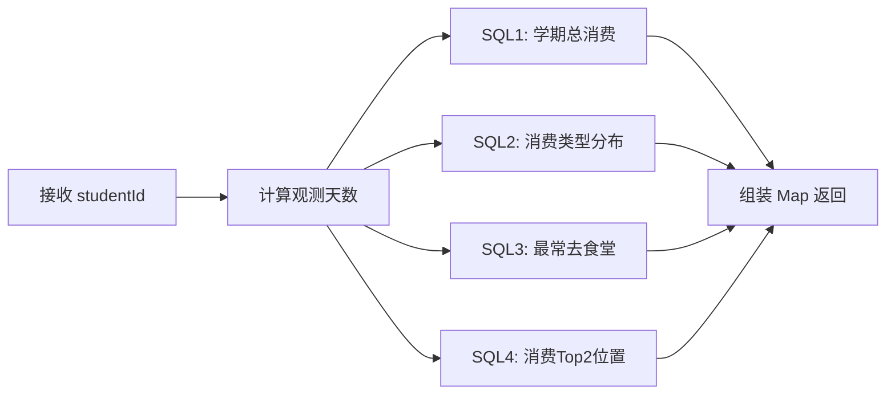
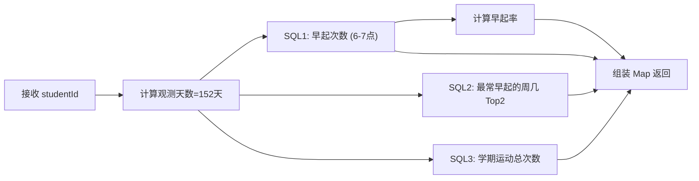
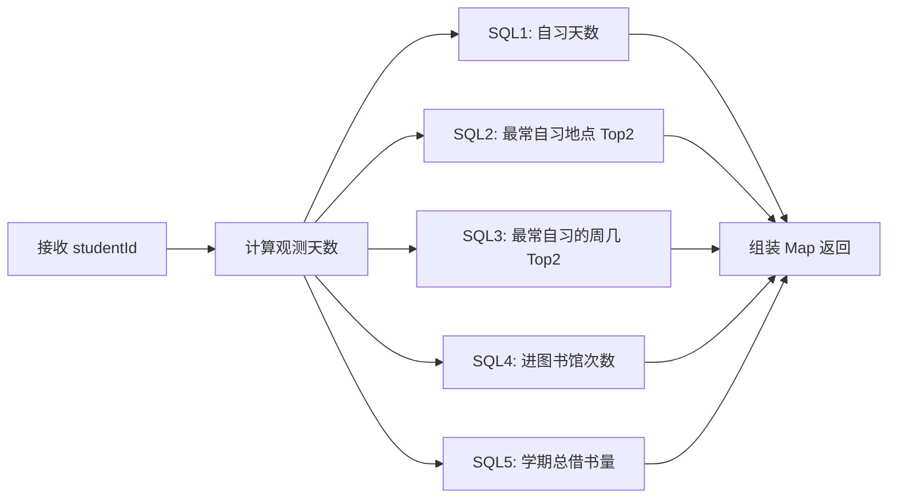

# 《高校学生行为特征分析与可视化系统》老项目架构与接口说明书

> **项目名称**: student_behavior_backend  
> **技术栈**: Spring Boot 2.6.4 + JdbcTemplate + MySQL 8.x + Lombok  
> **JDK 版本**: 1.8  
> **默认端口**: 8080  
> **包路径**: `com.bs.student_behavior`  
> **逆向提取日期**: 2026-03-08  

---

## 1. 系统全局拓扑与目录结构

### 1.1 系统架构概览

```
┌──────────┐     HTTP/JSON      ┌───────────────────┐      JDBC        ┌─────────┐
│ Vue 前端  │ ───────────────▶  │ Spring Boot 后端   │ ──────────────▶  │ MySQL   │
│          │ ◀─────────────── │  (student_behavior) │ ◀────────────── │         │
└──────────┘    Result<T>      └───────────────────┘                  └─────────┘
                                        │                                    ▲
                                        │                                    │
                               ┌────────▼────────┐                          │
                               │ student_behavior │  Spark ETL 批处理       │
                               │   _spark (PySpark)│ ──────────────────────┘
                               └─────────────────┘ (离线生成28张宽表写入MySQL)
```

> **关键设计**: 系统采用**离线批处理 + 在线查询**的经典 BI 架构。PySpark 脚本负责从原始校园一卡通、图书馆门禁、GPS 轨迹等数据源进行 ETL，聚合写入 MySQL「宽表」；Spring Boot 后端仅做**纯只读查询**，Controller → Service → JdbcTemplate 直连 SQL，**无 ORM 框架、无 Mapper XML**。

### 1.2 核心目录树

```
student_behavior_backend/
├── pom.xml                          # Maven 构建配置
├── student_behavior.sql             # 数据库 DDL + 示例数据 (28张表)
├── student_behavior_data.sql        # 生产环境全量数据 (~22MB)
├── src/main/
│   ├── resources/
│   │   └── application.yml          # 数据源配置 (MySQL root:123456@3306)
│   └── java/com/bs/student_behavior/
│       ├── StudentBehaviorApplication.java   # Spring Boot 启动类
│       ├── Controller/              # 10 个 REST 控制器 (API 路由层)
│       │   ├── LoginController.java          # 登录认证
│       │   ├── studentController.java        # 学生个人行为数据 (17个接口)
│       │   ├── studentTargetController.java  # 行为画像 & 聚类分析 (11个接口)
│       │   ├── CanteenController.java        # 食堂总览
│       │   ├── CanteenHourController.java    # 食堂小时消费
│       │   ├── CanteenShopController.java    # 食堂档口
│       │   ├── LibraryMonthController.java   # 图书馆月统计
│       │   ├── LibraryHourController.java    # 图书馆小时统计
│       │   ├── LibraryWeekContrllor.java     # 图书馆周统计
│       │   └── SchoolFlowController.java     # 校园人流热力图
│       ├── Entity/                  # 27 个实体类 (POJO, Lombok @Data)
│       ├── Service/                 # 26 个 Service 接口
│       │   └── Impl/               # 26 个 Service 实现
│       └── Mapper/                  # 空目录 (未使用 MyBatis)
└── student_behavior_spark/          # PySpark ETL (离线数据处理)
    ├── spark_etl.py                 # ETL 主脚本 (~41KB)
    └── output/                      # 生成的 28 张表 SQL 文件
```

### 1.3 模块职责边界

| 模块 | 职责 |
|------|------|
| **Controller** | HTTP 路由入口，全部使用 `@RequestMapping`，无鉴权中间件，透传参数至 Service |
| **Service (接口)** | 定义业务方法签名，一般为简单 CRUD 方法 |
| **Service/Impl** | 核心逻辑所在地，直接使用 `JdbcTemplate` 编写 SQL 查询。**无事务管理** |
| **Entity** | 纯 POJO (Lombok `@Data`)，映射数据库表字段。含通用返回体 `Result<T>` |
| **Mapper/** | ❌ 空目录，**未使用 MyBatis，全部使用 Spring JdbcTemplate** |
| **student_behavior_spark/** | PySpark 离线 ETL 脚本，从原始数据生成 28 张分析宽表 |

---

## 2. 核心数据模型与实体关联

### 2.1 数据表一览 (共 28 张表)

| # | 表名 | 主题域 | 说明 |
|---|------|--------|------|
| 1 | `user_table` | 认证 | 用户登录表 (account + password + role) |
| 2 | `allstudent` | 行为总表 | 学生行为记录 (id + date + action) |
| 3 | `canteen_table` | 食堂 | 食堂消费总统计 (早/中/晚) |
| 4 | `canteenhourconsumption_table` | 食堂 | 食堂每小时消费 |
| 5 | `canteenshop_table` | 食堂 | 食堂档口消费 |
| 6 | `schoolflow_table` | 校园 | 校园人流热力图 (date + time + 经纬度) |
| 7 | `librarymonthnum_table` | 图书馆 | 每月进馆人次 |
| 8 | `libraryhournum_table` | 图书馆 | 每小时进馆 (工作日/周末) |
| 9 | `libraryweeknum_table` | 图书馆 | 每周各天进馆人次 |
| 10 | `studentmonthconsumption_table` | 个人消费 | 学生月消费总额 |
| 11 | `studentconsumptiontype_table` | 个人消费 | 消费类型分布 (餐饮/超市/其他) |
| 12 | `studentpositionconsumption_table` | 个人消费 | 消费位置统计 |
| 13 | `studentconsumptiontop_table` | 个人消费 | 消费 TOP 排名 |
| 14 | `studentdayconsumption_table` | 个人消费 | 每日消费明细 |
| 15 | `studentweekconsumption_table` | 个人消费 | 每周消费 |
| 16 | `studenteating_table` | 饮食 | 用餐记录 (日期 + 时间 + 餐次) |
| 17 | `studentweekeating_table` | 饮食 | 每周用餐统计 |
| 18 | `studentgetup_table` | 作息 | 起床时间记录 |
| 19 | `studentsport_table` | 运动 | 运动记录 (位置 + 时长 + 次数) |
| 20 | `studentstudyposition_table` | 学习 | 自习位置偏好 |
| 21 | `studentdaystudy_table` | 学习 | 每日自习统计 |
| 22 | `studentstudytime_table` | 学习 | 自习时间段统计 |
| 23 | `studentmonthbook_table` | 图书 | 月度借书量 |
| 24 | `studentdaybooklend_table` | 图书 | 借书明细 (书名 + 评分) |
| 25 | `studentcardrecharge_table` | 充值 | 校园卡充值记录 |
| 26 | `student_prediction` | 画像 | ML 行为预测结果 (6维分类编号) |
| 27 | `kind_features` | 画像 | 分类特征描述字典表 |
| 28 | `kind_probability` | 画像 | 分类概率统计表 |

### 2.2 ER 图

```mermaid
erDiagram
    user_table {
        varchar user PK "学号/管理员账号"
        varchar password "密码"
        varchar role PK "角色: s=学生, t=教师"
    }

    allstudent {
        varchar id FK "学生学号"
        varchar date "日期"
        varchar action "行为类型"
    }

    student_prediction {
        varchar id FK "学生学号"
        varchar target PK "预测目标(6维度)"
        int prediction "分类编号"
    }

    kind_features {
        varchar target PK "目标类型"
        int kind PK "分类编号"
        varchar describe "分类描述"
    }

    kind_probability {
        varchar target FK "目标类型"
        int kind FK "分类编号"
        int count "人数"
        double probability "概率"
    }

    canteen_table {
        varchar canteenName PK "食堂名称"
        int canteenSum "消费总次数"
        int breakfirstNum "早餐次数"
        int lunchNum "午餐次数"
        int dinnerNum "晚餐次数"
    }

    canteenhourconsumption_table {
        varchar canteenName FK "食堂名称"
        int time "小时"
        int consumptionNum "消费次数"
    }

    canteenshop_table {
        varchar canteenName FK "食堂名称"
        varchar canteenShopName "档口名称"
        int consumptionNum "消费次数"
    }

    schoolflow_table {
        varchar date "日期"
        varchar time "时间"
        varchar position "位置名称"
        varchar lng "经度"
        varchar lat "纬度"
        int Num "人数"
    }

    librarymonthnum_table {
        varchar year "年份"
        varchar month "月份"
        varchar date "日期"
        int studentNum "学生人数"
    }

    libraryhournum_table {
        varchar dayType "日期类型"
        int time "小时"
        int studentNum "学生人数"
    }

    libraryweeknum_table {
        varchar week PK "星期几"
        int studentNum "学生人数"
    }

    studentmonthconsumption_table {
        varchar id FK "学生学号"
        varchar year "年份"
        varchar month "月份"
        int consumptionNum "消费金额"
    }

    studentconsumptiontype_table {
        varchar id FK "学生学号"
        varchar consumptionType "消费类型"
        int consumptionNum "消费金额"
    }

    studentpositionconsumption_table {
        varchar id FK "学生学号"
        varchar positionName "消费位置"
        varchar type "位置类型"
        int consumptionNum "消费金额"
    }

    studentconsumptiontop_table {
        varchar id FK "学生学号"
        varchar positionName "消费位置"
        int consumptionNum "消费金额"
    }

    studenteating_table {
        varchar id FK "学生学号"
        varchar date "日期"
        int time "时间"
        varchar type "餐次类型"
    }

    studentgetup_table {
        varchar id FK "学生学号"
        varchar date "日期"
        varchar day "星期几"
        int time "起床小时"
    }

    studentsport_table {
        varchar id FK "学生学号"
        varchar day "星期几"
        int hour "时长"
        varchar position "地点"
        int sportNum "次数"
    }

    studentstudyposition_table {
        varchar id FK "学生学号"
        varchar day "星期几"
        varchar position "自习地点"
        int studyNum "次数"
    }

    studentmonthbook_table {
        varchar id FK "学生学号"
        varchar year "年份"
        varchar month "月份"
        int bookNum "借书数量"
    }

    studentdaybooklend_table {
        varchar id FK "学生学号"
        varchar date "日期"
        varchar bookName "书名"
        int score "评分"
    }

    studentcardrecharge_table {
        varchar id FK "学生学号"
        varchar date "日期"
        varchar day "星期几"
        int rechargeNum "充值金额"
    }

    user_table ||--o{ allstudent : "学号关联"
    user_table ||--o{ student_prediction : "学号关联"
    user_table ||--o{ studentmonthconsumption_table : "学号关联"
    user_table ||--o{ studenteating_table : "学号关联"
    user_table ||--o{ studentgetup_table : "学号关联"
    user_table ||--o{ studentsport_table : "学号关联"
    user_table ||--o{ studentstudyposition_table : "学号关联"
    user_table ||--o{ studentmonthbook_table : "学号关联"
    user_table ||--o{ studentcardrecharge_table : "学号关联"

    student_prediction }o--|| kind_features : "target+prediction=kind"
    kind_probability }o--|| kind_features : "target+kind 字典关联"

    canteen_table ||--o{ canteenhourconsumption_table : "食堂名称"
    canteen_table ||--o{ canteenshop_table : "食堂名称"
```



### 2.3 数据关系要点

1. **以学号 `id` 为核心外键**: 表 2、10～25 均通过 `id` (学号) 与 `user_table` 关联，但数据库**无物理外键约束**
2. **行为画像三表联动**: `student_prediction` ↔ `kind_features` ↔ `kind_probability` 三表通过 `(target, kind/prediction)` 联合关联，实现「学生 → 预测分类 → 分类描述 → 分类概率」的查询链
3. **食堂维度表**: `canteen_table` → `canteenhourconsumption_table` / `canteenshop_table` 通过 `canteenName` 关联
4. **图书馆独立聚合**: 三张图书馆表 (7/8/9) 互相独立，分别按月/时/周维度统计全校数据

---

## 3. API 接口定义资产

### 3.0 统一返回结构

所有接口返回 `Result<T>` JSON:
```json
{
  "code": "1",
  "msg": "success",
  "data": "<实际业务数据>"
}
```

> **注意**: 全部接口均为 `@RequestMapping` (默认支持 GET/POST)，参数通过 Query String 传递，**无请求体 JSON**。无鉴权/Token 机制。

---

### 3.1 认证模块

| # | 路径 | 方法 | 入参 | 返回 data | 说明 |
|---|------|------|------|-----------|------|
| 1 | `/login` | GET | `user`, `password`, `role` | `"true"` / `"false"` | 登录验证 |
| 2 | `/test` | GET | 无 | `"true"` | 健康检查 |
| 3 | `/findStudentById` | GET/POST | `id` | `"true"` / `"false"` | 检查学生是否存在 |

> **登录逻辑** (`userServiceImpl`):
> ```sql
> SELECT * FROM user_table WHERE user=? AND password=? AND role=?
> ```
> 密码明文比对，role='s' 为学生，role='t' 为教师/管理员。

---

### 3.2 学生个人行为数据 (studentController)

| # | 路径 | 入参 | 返回 data 类型 | 对应表 |
|---|------|------|---------------|--------|
| 4 | `/StudentMonthConsumption` | `id`, `year`, `month` | `List<StudentMonthConsumption>` | `studentmonthconsumption_table` |
| 5 | `/StudentConsumptionType` | `id`, `year`, `month` | `List<ConsumptionType>` | `studentconsumptiontype_table` |
| 6 | `/StudentDayConsumption` | `studentId`, `year`, `month` | `List<StudentDayConsumption>` | `studentdayconsumption_table` |
| 7 | `/StudentWeekConsumption` | `studentId`, `year`, `month` | `List<StudentWeekConsumption>` | `studentweekconsumption_table` |
| 8 | `/StudentPositionConsumption` | `id` | `List<StudentpositionConsumption>` | `studentpositionconsumption_table` |
| 9 | `/StudentCardRecharge` | `studentId` | `List<StudentRecharge>` | `studentcardrecharge_table` |
| 10 | `/StudentPositionTop` | `studentId` | `List<StudentConsumptionTop>` | `studentconsumptiontop_table` |
| 11 | `/StudentGetUp` | `studentId` | `List<StudentGetUp>` | `studentgetup_table` |
| 12 | `/StudentDayEating` | `studentId` | `List<StudentDayEating>` | `studenteating_table` |
| 13 | `/StudentWeekEating` | `studentId` | `List<StudentWeekEating>` | `studentweekeating_table` |
| 14 | `/StudentSport` | `studentId` | `List<StudentSport>` | `studentsport_table` |
| 15 | `/StudentDayStudy` | `studentId` | `List<StudentDayStudy>` | `studentdaystudy_table` |
| 16 | `/StudentTimeStudy` | `studentId` | `List<StudentStudyTime>` | `studentstudytime_table` |
| 17 | `/StudentPositionStudy` | `studentId` | `List<StudentPositionStudy>` | `studentstudyposition_table` |
| 18 | `/StudentMonthBook` | `studentId`, `year`, `month` | `List<StudentMonthBookLend>` | `studentmonthbook_table` |
| 19 | `/StudentDayBookLend` | `studentId`, `year`, `month` | `List<StudentDayBookLend>` | `studentdaybooklend_table` |

> **注意**: 参数命名不统一 —— 部分接口用 `id`，部分用 `studentId`。

---

### 3.3 食堂数据模块

| # | 路径 | 入参 | 返回 data | 对应表 |
|---|------|------|-----------|--------|
| 20 | `/Canteen` | 无 | `List<Canteen>` 全部食堂统计 | `canteen_table` |
| 21 | `/CanteenHourConsumption` | 无 | `List<Canteenhour>` 全部食堂小时消费 | `canteenhourconsumption_table` |
| 22 | `/canteenlist` | 无 | `List<String>` 食堂名称列表 | `canteenshop_table` DISTINCT |
| 23 | `/findCanteenShop` | `canteenName` | `List<Canteenshop>` 前12档口 | `canteenshop_table` LIMIT 12 |

---

### 3.4 图书馆数据模块

| # | 路径 | 入参 | 返回 data | 对应表 |
|---|------|------|-----------|--------|
| 24 | `/getMonth` | 无 | `List<Map>` 可选年月列表 | `librarymonthnum_table` DISTINCT |
| 25 | `/findDayBymonth` | `year`, `month` | `List<LibraryMonth>` 每日进馆数 | `librarymonthnum_table` |
| 26 | `/findAllBymonth` | `year`, `month` | `List<Map>` 月度总人次 | `librarymonthnum_table` SUM |
| 27 | `/LibraryHourNum` | 无 | `List<LibraryHour>` 每小时进馆 | `libraryhournum_table` |
| 28 | `/LibraryWeekNum` | 无 | `List<LibraryWeek>` 每周进馆 | `libraryweeknum_table` |

---

### 3.5 校园人流热力图

| # | 路径 | 入参 | 返回 data | 对应表 |
|---|------|------|-----------|--------|
| 29 | `/schoolflow` | `date` (yyyy-MM-dd) | `List<SchoolFlow>` 各位置经纬度+人数 | `schoolflow_table` |

> 前端可用于在地图上渲染热力图，数据包含 `lng`(经度)、`lat`(纬度)、`Num`(人数)。

---

### 3.6 行为画像与聚类分析 (studentTargetController)

| # | 路径 | 入参 | 返回 data | 说明 |
|---|------|------|-----------|------|
| 30 | `/consumptionlevel` | `studentId` | `Map` 消费水平综合数据 | 见 §4.1 |
| 31 | `/selfdiscipline` | `studentId` | `Map` 自律综合数据 | 见 §4.2 |
| 32 | `/studyhard` | `studentId` | `Map` 学习努力综合数据 | 见 §4.3 |
| 33 | `/studentdescribe` | `studentId` | `Map{studentdescribe: List}` | 6维行为画像标签 |
| 34 | `/studentconsumptionKind` | 无 | `List<KindProbability>` | 消费聚类分布 |
| 35 | `/studentselfdisplineKind` | 无 | `List<KindProbability>` | 自律聚类分布 |
| 36 | `/studenteatingKind` | 无 | `List<KindProbability>` | 饮食聚类分布 |
| 37 | `/studentstudyKind` | 无 | `List<KindProbability>` | 学习聚类分布 |
| 38 | `/studentsportKind` | 无 | `List<KindProbability>` | 运动聚类分布 |
| 39 | `/studentENBKind` | 无 | `List<KindProbability>` | 综合聚类分布 (ENB) |
| 40 | `/StudentFDetail` | `features` (分类描述) | `List<StudentFDetail>` | 按分类查学生列表 |

---

## 4. 核心业务逻辑与算法思路

> [!IMPORTANT]
> **这是整个系统最核心的部分**。位于 [StudentTargetServiceImpl.java](file:///d:/BaiduNetdiskDownload/20184351138%E8%82%96%E5%BB%BA%E5%B3%B0-%E6%AF%95%E4%B8%9A%E8%AE%BE%E8%AE%A1%E7%94%B5%E5%AD%90%E7%89%88/20184351138+%E8%82%96%E5%BB%BA%E5%B3%B0+%E7%A8%8B%E5%BA%8F%E5%8E%8B%E7%BC%A9%E5%8C%85/student_behavior_backend/src/main/java/com/bs/student_behavior/Service/Impl/StudentTargetServiceImpl.java) 和 [StudentKindServiceImpl.java](file:///d:/BaiduNetdiskDownload/20184351138%E8%82%96%E5%BB%BA%E5%B3%B0-%E6%AF%95%E4%B8%9A%E8%AE%BE%E8%AE%A1%E7%94%B5%E5%AD%90%E7%89%88/20184351138+%E8%82%96%E5%BB%BA%E5%B3%B0+%E7%A8%8B%E5%BA%8F%E5%8E%8B%E7%BC%A9%E5%8C%85/student_behavior_backend/src/main/java/com/bs/student_behavior/Service/Impl/StudentKindServiceImpl.java)。

### 4.1 消费水平画像 (`/consumptionlevel`)

**计算流程**:



| 指标 | SQL | 计算口径 |
|------|-----|---------|
| **观测天数** | Java 代码计算 | `(2019-01-31) - (2018-09-01)` = 固定 152 天 |
| **学期总消费** | `SELECT sum(consumptionNum) FROM studentmonthconsumption_table WHERE id=?` | 全学期累计 |
| **消费类型分布** | `SELECT consumptionType, Sum(consumptionNum) FROM studentconsumptiontype_table WHERE id=? GROUP BY consumptionType` | 按类型 (餐饮/超市/其他) 分组 |
| **最常去食堂** | `...WHERE type='canteen' GROUP BY positionName ORDER BY desc LIMIT 1` | 食堂消费金额 TOP1 |
| **消费 TOP2** | `...FROM studentconsumptiontop_table ORDER BY consumptionNum desc LIMIT 2` | 全品类消费 TOP2 店铺 |

**返回结构**:
```json
{
  "days": 152,
  "Allconsumption": 3900,
  "consumptionType": [{"consumptionType":"餐饮","consumptionNum":1880}, ...],
  "canteen": {"positionName":"一食堂","canteenconsumptionNum":1200},
  "positionTop": [{"positionName":"兰州拉面"}, {"positionName":"黄焖鸡"}]
}
```

---

### 4.2 自律画像 (`/selfdiscipline`)

**计算流程**:



| 指标 | SQL | 计算口径 |
|------|-----|---------|
| **早起次数** | `SELECT count(id) FROM studentgetup_table WHERE id=? AND (time=6 OR time=7)` | 起床时间在 6点或7点 视为"早起" |
| **早起率** | Java: `getupNum / 152` | 早起天数 ÷ 学期总天数，保留2位小数 |
| **最佳早起日** | `...GROUP BY day ORDER BY getupnum desc LIMIT 2` | 按星期分组取 TOP2 |
| **运动总次数** | `SELECT sum(sportNum) FROM studentsport_table WHERE id=?` | 全学期运动累计 |

> [!NOTE]
> **关键判定规则**: 起床时间 `time IN (6, 7)` 即判定为"早起"。`time=8` 及以上不算。自律指标 = 早起率 + 运动量的综合，但前端展示时具体阈值未在后端代码中定义，由聚类模型在 Spark ETL 中完成。

---

### 4.3 学习努力画像 (`/studyhard`)

**计算流程**:



| 指标 | SQL | 计算口径 |
|------|-----|---------|
| **自习总天数** | `SELECT count(DISTINCT date) FROM allstudent WHERE id=? AND action='自习或科研'` | 在行为总表中 action 筛选 |
| **最爱自习地点** | `...FROM studentstudyposition_table GROUP BY position ORDER BY studyNum desc LIMIT 2` | TOP2 地点 |
| **最常自习周几** | `...GROUP BY day ORDER BY studyNum desc LIMIT 2` | TOP2 星期 |
| **进馆次数** | `SELECT count(id) FROM allstudent WHERE action='进入图书馆'` | 从行为总表计数 |
| **借书量** | `SELECT sum(bookNum) FROM studentmonthbook_table WHERE id=?` | 全学期累计 |

---

### 4.4 行为画像标签 (`/studentdescribe`)

**SQL**:
```sql
SELECT s.target, f.describe
FROM student_prediction s
JOIN kind_features f ON s.target = f.target AND s.prediction = f.kind
WHERE id = ?
GROUP BY target
```

**返回**: 6 个维度的行为标签，例如:
```json
{
  "studentdescribe": [
    {"target": "consumption", "describe": "节约型消费"},
    {"target": "studyhard",   "describe": "努力型"},
    {"target": "eating",      "describe": "规律饮食"},
    {"target": "sport",       "describe": "运动达人"},
    {"target": "selfdiscipline", "describe": "基本自律"},
    {"target": "ENB",         "describe": "综合良好"}
  ]
}
```

---

### 4.5 六维聚类体系

系统预定义了 **6 个行为维度**，每个维度通过聚类产生 **3 个分类**:

| 维度 target | 含义 | 分类 1 | 分类 2 | 分类 3 |
|------------|------|--------|--------|--------|
| `consumption` | 消费水平 | 节约型消费 | 适中型消费 | 高消费型 |
| `studyhard` | 学习努力 | 学霸型 | 努力型 | 一般型 |
| `eating` | 饮食习惯 | 规律饮食 | 不规律饮食 | 偏好外卖 |
| `sport` | 运动情况 | 运动达人 | 偶尔运动 | 运动较少 |
| `selfdiscipline` | 自律程度 | 高度自律 | 基本自律 | 自律性较差 |
| `ENB` | 综合评价 | 综合优秀 | 综合良好 | 综合一般 |

> [!NOTE]
> **聚类算法在 PySpark ETL 中执行** (位于 `student_behavior_spark/spark_etl.py`)，Spring Boot 后端只负责查询预计算结果。聚类模型的特征工程和训练过程不在 Java 代码中。

### 4.6 分类概率查询 (`/student*Kind` 系列接口)

6 个 Kind 接口共用同一 SQL 模式:
```sql
SELECT p.target, f.describe, p.kind, count, probability
FROM kind_probability p
INNER JOIN kind_features f ON p.target = f.target AND p.kind = f.kind
WHERE p.target = '{dimension}'
```

返回该维度下各分类的**人数**和**概率**，用于前端渲染饼图/柱状图。

特殊逻辑: `/studentENBKind` 使用了嵌套子查询并对 `describe` 做 `GROUP BY`，对概率和人数做了 `SUM` 聚合，说明 ENB (综合评价) 可能存在多条记录需要合并。

### 4.7 按分类标签反查学生 (`/StudentFDetail`)

```sql
SELECT s.id, s.target, k.describe
FROM kind_features k
INNER JOIN student_prediction s ON k.kind = s.prediction AND k.target = s.target
WHERE k.describe = ?
ORDER BY s.id
```

输入一个分类描述（如"学霸型"），返回所有被归类到该标签的学生列表。

---

## 5. 其他技术要点

### 5.1 数据访问模式

- **无 ORM**: 全部使用 `JdbcTemplate.query()` + `BeanPropertyRowMapper` 手写 SQL
- **无事务管理**: 无 `@Transactional` 注解，所有操作均为只读查询
- **无分页**: 除档口排名使用 `LIMIT 12` 外，其余接口返回全量数据
- **Null 处理**: `StudentTargetServiceImpl.mapNullToEmpty()` 递归将所有 null 值替换为 `0`

### 5.2 安全性

- **无鉴权机制**: 无 Spring Security / JWT / Session 管理
- **密码明文存储**: `user_table.password` 直接存储明文
- **无 CORS 配置**: 代码中未见 CORS 过滤器 (可能在前端通过代理解决)
- **SQL 注入防护**: 使用 `?` 占位符 + `Object[]` 参数化查询，基本安全

### 5.3 数据时间范围

- 整个系统的数据覆盖 **2018年9月 ～ 2019年1月** (一个学期)
- 起止日期在代码中**硬编码**为 `2018-9-1` 和 `2019-1-31`
- 校园人流/GPS 数据来源于真实的校园一卡通和 WiFi 探针数据
