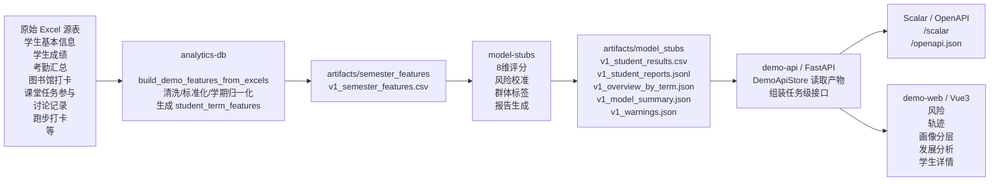
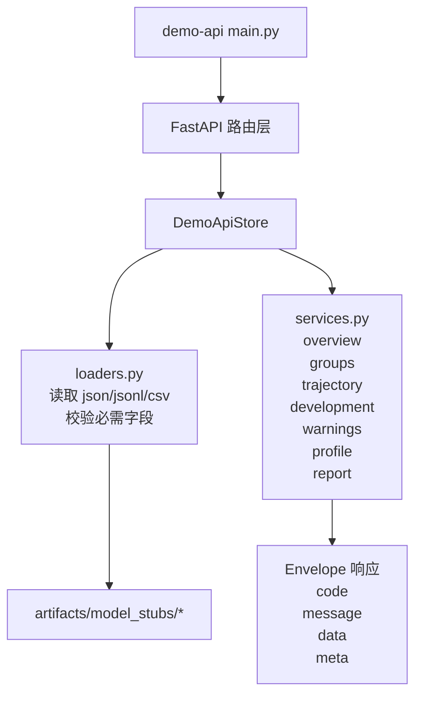
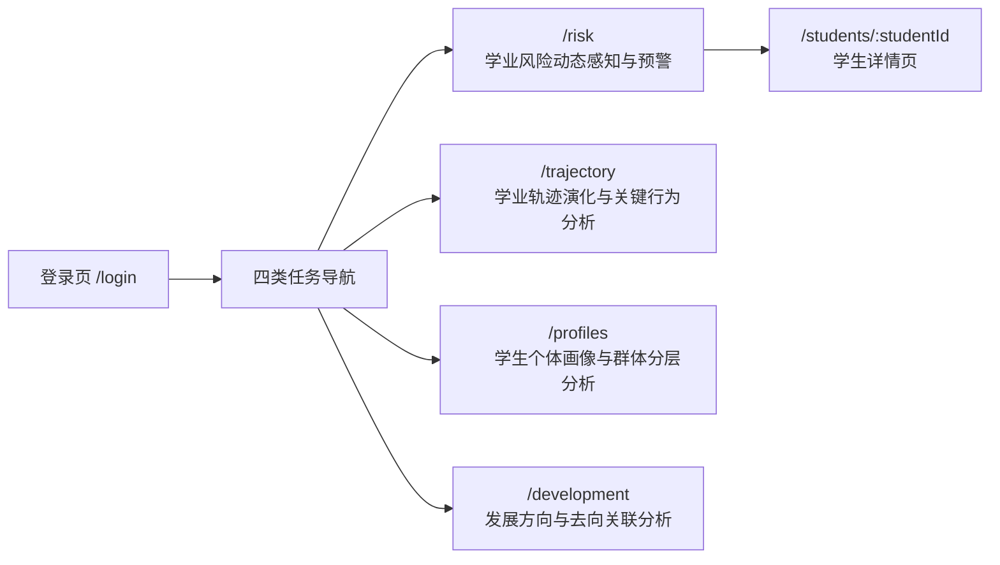
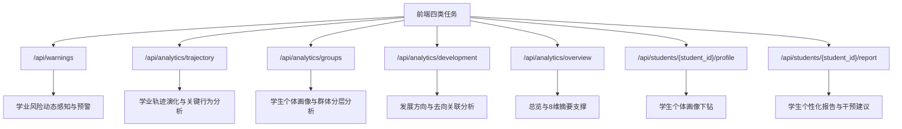
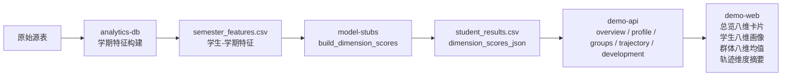

# Architecture Baseline

Last Updated: 2026-04-04

## 当前版本定位

当前仓库正在运行的不是旧版 Spring Boot + MySQL 系统，而是一个为比赛演示和结果迭代重构后的新架构。它采用“离线产物生成 + 在线 API 包装 + 前端任务化展示”的分层方式，围绕四类分析任务组织页面与接口。

当前主工作树:

- `C:\Users\Orion\Desktop\program\StudentBehavior\.worktrees\academic-risk-warning`

当前四类任务入口:

- 学业风险动态感知与预警
- 学业轨迹演化与关键行为分析
- 学生个体画像与群体分层分析
- 发展方向与去向关联分析

## 当前系统分层

### 1. 原始数据层

原始数据主要来自 Excel 源表，集中在数据目录中，覆盖学生成绩、考勤、课堂任务、讨论记录、图书馆、跑步打卡、综合测评等主题。

### 2. 特征构建层

`projects/analytics-db` 负责从原始 Excel 源表中读取数据，完成：

- 字段标准化
- 学号归一化
- 学期归一化
- 学生-学期粒度聚合
- 8 维相关支撑指标的构建

产物输出到：

- `artifacts/semester_features/v1_semester_features.csv`

### 3. 规则与结果生成层

`projects/model-stubs` 基于学期特征表生成：

- 学生级 8 维结果
- 风险概率与风险等级
- 风险变化方向
- 群体标签
- 风险因子与保护因子
- 个性化报告
- 学期总览产物

产物输出到：

- `artifacts/model_stubs/v1_student_results.csv`
- `artifacts/model_stubs/v1_student_reports.jsonl`
- `artifacts/model_stubs/v1_overview_by_term.json`
- `artifacts/model_stubs/v1_model_summary.json`
- `artifacts/model_stubs/v1_warnings.json`

### 4. API 服务层

`projects/demo-api` 不直接连接数据库，而是读取 `artifacts/model_stubs` 产物文件，在 `DemoApiStore` 中完成二次聚合与任务级接口包装，对外提供统一的 JSON Envelope 返回。

当前接口还附带：

- OpenAPI
- Scalar 文档
- 中文 summary / description
- 参数示例与响应示例

### 5. 前端展示层

`projects/demo-web` 使用 Vue 3 + Vite + TanStack Query + Vue Router + ECharts，按四类分析任务组织页面，而不是按旧版“总览/四象限”组织。

## 总体架构图

## 后端处理流

## 前端页面组织图

## 四类任务与接口对应关系

## 8 维指标数据流

## 8 维指标与典型源表映射

| 8 维 | 典型源表 | 当前链路说明 |
|---|---|---|
| 学业基础表现 | `学生成绩.xlsx` | 绩点、挂科、边缘课程等学业基础指标 |
| 课堂学习投入 | `考勤汇总.xlsx`、课堂相关附加表 | 出勤、迟到、旷课、缺勤等课堂投入信号 |
| 在线学习积极性 | `课堂任务参与.xlsx`、`讨论记录.xlsx`、线上相关表 | 任务参与、讨论互动、线上学习表现 |
| 图书馆沉浸度 | `图书馆打卡记录.xlsx` | 入馆频次、周均访问等 |
| 网络作息自律指数 | `上网统计` 等 | 深夜上网、在线时长等，目前部分学期覆盖不足 |
| 早晚生活作息规律 | `门禁数据`、签到类表 | 早出晚归、作息边界信号 |
| 体质及运动状况 | `体测数据`、`跑步打卡.xlsx`、`日常锻炼` | 运动频次、体测达标情况 |
| 综合荣誉与异动预警 | `本科生综合测评.xlsx`、奖学金/异动类表 | 荣誉、测评、异动相关信号 |

## 当前关键设计特点

- 当前系统是“离线计算 + 在线查询展示”，不是实时数据库分析系统。
- `demo-api` 的职责是读取结果产物并包装成稳定接口，不承担重计算。
- 真正影响结果质量的核心在于：
  - `analytics-db` 的特征接入是否真实、完整
  - `model-stubs` 的 8 维校准与风险规则是否合理
- 四类任务页消费的是同一批学生-学期结果，只是按不同业务视角重新组织。

## 运行主链路

1. 从 Excel 源表读取学生行为与学业数据。
2. 通过 `analytics-db` 构建学生-学期特征表。
3. 通过 `model-stubs` 生成风险、画像、报告和总览产物。
4. 通过 `demo-api` 读取产物并暴露标准接口。
5. 通过 `demo-web` 在四类任务页和学生详情页中展示。

## 关键目录

- `projects/analytics-db`
- `projects/model-stubs`
- `projects/demo-api`
- `projects/demo-web`
- `artifacts/semester_features`
- `artifacts/model_stubs`
- `docs`

## 当前架构结论

当前项目已经具备一条完整的可运行演示链路：

- 原始数据
- 学期特征
- 规则产物
- API 包装
- 四类任务前端展示

后续如果继续演进，优先级通常应放在：

1. 补强 `analytics-db` 的真实指标覆盖
2. 继续校准 `model-stubs` 的风险与 8 维规则
3. 再扩展 `demo-api` 接口对象
4. 最后细化前端展示与答辩叙事
