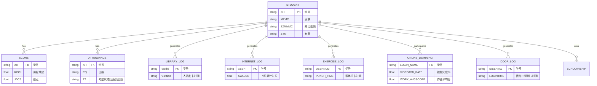

# 智慧教育学生行为分析 - 数据挖掘与建模方案

## 1. 核心实体关系图 (ER Diagram)
基于当前的业务数据集结构，是以“学生”为中心节点的星型结构。各宽表打通的核心主键为 `学号`（个别表表现为 `XSBH` / `WID` / `cardId` / `USERNUM`）：

## 2. 学生行为特征维度提取清单 (8类指标)

为了全面捕捉学生的学习与生活行为习惯，以便为学业风险预测与聚类提供支撑，后端在做 ETL 和特征工程时需根据原始数据聚合出以下 8 个高关注度维度的衍生存量指标（按学期或学年聚合）：

1. **学业基础表现 (Academic Base)**：总修读平均绩点(GPA)、挂科总次数、及格边缘游离度。（关联表：`学生成绩`）
2. **课堂学习投入 (Class Engagement)**：全勤率、逃课或迟到总计频次、课堂平均专注度（抬头率/前排率）。（关联表：`考勤汇总`、`上课信息统计表`）
3. **在线学习积极性 (Online Activeness)**：视频观看比率、测验得分稳定度、论坛交互活跃度（如发帖/回复数）。（关联表：`课堂任务参与`、`线上学习`）
4. **图书馆沉浸度 (Library Immersion)**：周均去图书馆打卡频次、单次平均逗留时长分布规律。（关联表：`图书馆打卡记录`）
5. **网络作息自律指数 (Network Habits)**：日均在线活动时长、深夜沉迷时段（0点-6点）频繁上网发生天数频次。（关联表：`上网统计`）
6. **早晚生活作息规律 (Daily Routine Boundary)**：早起规律性（首日进出规律情况）、晚归总频次（门禁晚于 23:00 打卡数据）。（关联表：`门禁数据`）
7. **体质及运动状况 (Physical Resilience)**：各项体测评分均值是否达标、每周自发跑步或锻炼习惯次数。（关联表：`体测数据`、`跑步打卡`、`日常锻炼`）
8. **综合荣誉与异动预警 (Appraisal & Status Alerts)**：所获各类奖学金金额及其级别，以往是否有学籍降级/处分等客观消极信号。（关联表：`奖学金获奖`、`学籍异动`）

## 3. 下一步工作建议（交接给后端开发库）

基于以上设计的底座，建议后端的进一步工作可以按以下技术栈落实：
- **数据清洗 (Pandas) / SQL ETL:** 将所有零散的表使用 Python `pandas.merge` 进行内连接和外连接，补充处理空值 (NaN)，输出以“学号”粒度聚合后的一张完整的 **特征宽表**。
- **降维聚类挖掘:** 使用 `Scikit-learn` 中的 KMeans 算法通过对前述特征施以离差标准化，划分出常见的 4 种典型学生群体（例如：奋斗学霸型、普通平庸型、游戏沉迷型、社交活跃型）。
- **预警模型建设:** 将具有挂科或留级倾向的记录标记标签，并带入到 `LightGBM/XGBoost` 构建树分类网络，输出风险学生的概率评分，要求 AUC 验证集表现 ≥ 80%。
- **因子可解释性:** 通过引入 `SHAP` 包输出 `shap_values` 图表，得出在预测一个学生具有学业风险时，起到决定性影响的至少三个关键因子（如出勤极低、深夜上网多、打卡不规律等）。
