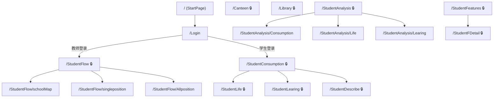
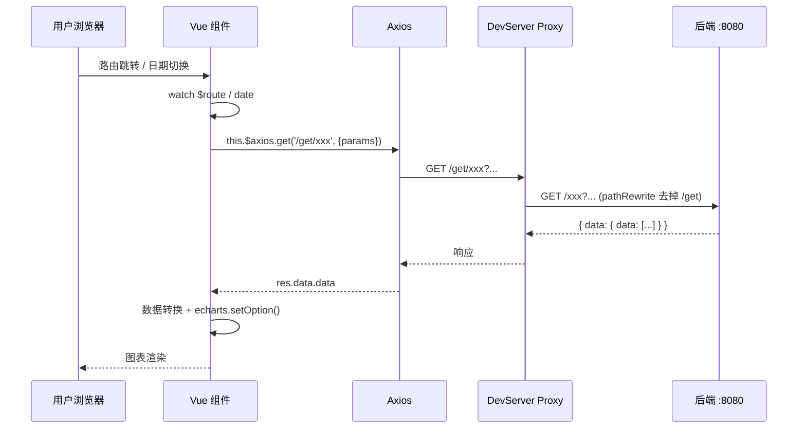

# 老前端项目架构与交互资产说明书

> **项目名称**: `student_behavior` (学生日常行为分析及可视化系统)
> **技术栈**: Vue 2.6 + Vue CLI 4.5 + Echarts 5 + Muse-UI 3 + Axios + Cesium
> **逆向日期**: 2026-03-08

---

## 1. 前端全局架构与依赖生态

### 1.1 核心技术栈

| 分类 | 库/框架 | 版本 | 作用 |
|------|---------|------|------|
| **框架** | Vue | ^2.6.11 | MVVM 核心框架 |
| **路由** | vue-router | ^3.2.0 | SPA 路由管理 (history 模式) |
| **状态管理** | Vuex | ^3.4.0 | 全局状态管理 (**已引入但实际未使用**，以 `sessionStorage` 替代) |
| **UI 组件库** | Muse-UI | ^3.0.2 | 日期选择器、轮播图、分页器等 |
| **数据可视化** | Echarts | ^5.2.2 | 柱状图/饼图/折线图/热力图 |
| **地图可视化** | echarts-gl | ^2.0.8 | 3D 图表支持 |
|  | echarts-amap | ^1.4.15 | 高德地图集成 |
|  | echarts-wordcloud | ^2.0.0 | 词云图 |
| **地理信息** | Cesium | ^1.82.1 | 3D 地球/校园地理可视化 |
| **网络请求** | Axios | ^0.25.0 | HTTP 请求 (挂载 `Vue.prototype.$axios`) |
| **工具库** | jQuery | ^3.6.0 | DOM 操作辅助 (通过 `ProvidePlugin` 全局注入) |
| **CSS 框架** | Bootstrap (内置) | - | 通过静态 CSS 文件引入 |
| **构建工具** | @vue/cli-service | ~4.5.0 | Webpack 封装构建 |

### 1.2 核心目录结构

```
student_behavior_frontend/
├── public/
│   ├── index.html              # HTML 模板
│   ├── favicon.ico
│   └── data/                   # 静态数据文件 (7 个)
├── src/
│   ├── main.js                 # 入口文件: 注册插件 + 路由守卫
│   ├── App.vue                 # 根组件 (深色背景 #132831)
│   ├── router/
│   │   └── index.js            # 路由配置 (12 条路由, history 模式)
│   ├── views/                  # 页面级组件 (17 个 .vue 文件)
│   │   ├── StartPage.vue       # 着陆页
│   │   ├── Login.vue           # 登录页
│   │   ├── Home.vue            # 教师端顶部导航栏
│   │   ├── SHome.vue           # 学生端顶部导航栏
│   │   ├── StudentFlow.vue     # 校园人流量（含地图子路由）
│   │   ├── Canteen.vue         # 食堂消费概览
│   │   ├── Library.vue         # 图书馆分析概览
│   │   ├── StudentAnalysis.vue # 学生分析（含消费/生活/学习三个子路由）
│   │   ├── StudentConsumption.vue  # 学生消费详情页
│   │   ├── StudentLife.vue     # 学生生活详情页
│   │   ├── StudentLearing.vue  # 学生学习详情页
│   │   ├── StudentDescribe.vue # 学生画像页 (轮播展示)
│   │   ├── StudentFeatures.vue # 学生特征分析看板 (教师端)
│   │   ├── StudentFDetail.vue  # 特征分类学生列表
│   │   ├── ConsumptionAnalysis.vue # 消费分析子页面
│   │   ├── LifeAnalysis.vue    # 生活分析子页面
│   │   └── LearingAnalysis.vue # 学习分析子页面
│   ├── components/             # 业务组件 (36 个, 按领域分目录)
│   │   ├── Consumption/        # 消费类图表组件 (7 个)
│   │   ├── Canteen/            # 食堂类图表组件 (4 个)
│   │   ├── Library/            # 图书馆类图表组件 (3 个)
│   │   ├── Life/               # 生活习惯图表组件 (4 个)
│   │   ├── Study/              # 学习类图表组件 (3 个)
│   │   ├── Map/                # 地图类组件 (4 个)
│   │   ├── Describe/           # 学生画像组件 (4 个)
│   │   └── Features/           # 特征分析图表组件 (6 个)
│   └── assets/                 # 静态资源 (498 个文件)
│       ├── static1/            # 着陆页 CSS/JS/图片
│       ├── static2/            # 后台页 CSS/JS/图片
│       └── logo.png
└── vue.config.js               # Webpack 配置 (代理/Cesium/别名)
```

### 1.3 构建配置要点 (`vue.config.js`)

| 配置项 | 值 | 说明 |
|--------|-----|------|
| `publicPath` | `/` | 根路径部署 |
| `devServer.port` | `8081` | 前端开发端口 |
| `devServer.proxy` | `/get` → `http://localhost:8080/` | 所有 API 请求通过 `/get` 前缀代理到后端 8080 端口 |
| `externals` | `AMap`, `BMap` | 高德/百度地图 SDK 通过 CDN 引入 |
| `resolve.alias` | `@` → `src/` | 路径别名 |

---

## 2. 路由拓扑与页面层级

### 2.1 路由全景图



### 2.2 路由权限矩阵

| 路径 | 页面名称 | `needLogin` | 角色 | 导航栏 |
|------|----------|:-----------:|:----:|:------:|
| `/` | 着陆欢迎页 | ❌ | 所有 | 无 |
| `/Login` | 登录页 | ❌ | 所有 | 无 |
| `/StudentFlow/*` | 校园人流量 | ✅ | 教师 | `Home` |
| `/Canteen` | 食堂消费 | ✅ | 教师 | `Home` |
| `/Library` | 图书馆分析 | ✅ | 教师 | `Home` |
| `/StudentFeatures` | 学生特征分析 | ✅ | 教师 | `Home` |
| `/StudentFDetail` | 特征明细 | ✅ | 教师 | `Home` |
| `/StudentAnalysis/*` | 个体学生分析 | ✅ | 教师 | `Home` |
| `/StudentConsumption` | 我的消费 | ✅ | 学生 | `SHome` |
| `/StudentLife` | 我的生活 | ✅ | 学生 | `SHome` |
| `/StudentLearing` | 我的学习 | ✅ | 学生 | `SHome` |
| `/StudentDescribe` | 我的画像 | ✅ | 学生 | `SHome` |

### 2.3 认证与路由守卫

认证机制完全基于 `sessionStorage`，在 `main.js` 中实现全局前置守卫：

```javascript
// 核心逻辑伪代码
router.beforeEach((to, from, next) => {
  if (sessionStorage.userName) {
    // 已登录: 对 /StudentAnalysis 做 query 参数持久化
    next();
  } else {
    // 未登录: 仅放行 '/' 和 '/Login'
    if (to.path === '/' || to.path === '/Login') next();
    else next('/Login');
  }
});
```

**存储的 Session 数据**:
- `userName`: 当前账号 (学号/工号)
- `flag`: 角色标识 (`'t'` = 教师, `'s'` = 学生)

**登录后跳转规则**:
- 教师 → `/StudentFlow/schoolMap` (校园地图)
- 学生 → `/StudentConsumption?studentId={学号}` (个人消费)

---

## 3. 核心业务组件与可视化资产

### 3.1 组件全景清单

#### 📊 Consumption (消费类, 7 个组件)

| 组件文件 | 图表类型 | Echarts 系列 | API 端点 | 数据维度 |
|----------|----------|:------------:|----------|----------|
| `ConsumptionType.vue` | **环形饼图** | `pie` | `/get/StudentConsumptionType` | `{consumptionNum, consumptionType}` |
| `DayConsumption.vue` | **柱状图** | `bar` | `/get/StudentDayConsumption` | dataset encoding: `x='date', y='consumptionNum'` |
| `ConsumptionWeek.vue` | **时间轴折线图** | `line` + `timeline` | `/get/StudentWeekConsumption` | `{week, consumptionNum, indexnum}` 按周分组 |
| `CAddress.vue` | 消费地点图表 | - | - | 消费地点分析 |
| `CardRecharge.vue` | 充值记录图表 | - | - | 一卡通充值分析 |
| `AddressTop.vue` | 热门地点排行 | - | - | 消费地点 TOP |
| `ConsumptionDetail.vue` | 消费明细 | - | - | 消费流水详情 |

#### 🍳 Canteen (食堂类, 4 个组件)

| 组件文件 | 图表类型 | Echarts 系列 | API 端点 |
|----------|----------|:------------:|----------|
| `CanteenSum.vue` | **象形柱图** | `pictorialBar` | `/get/Canteen` |
| `CanteenDayConsumption.vue` | 日消费图表 | - | - |
| `CanteenHourConsumption.vue` | 时段消费图表 | - | - |
| `CanteenTop.vue` | 食堂排行 | - | - |

#### 📚 Library (图书馆类, 3 个组件)

| 组件文件 | 图表类型 | API 端点 |
|----------|----------|----------|
| `BookMonthBorrow.vue` | 月借阅量 | - |
| `LibraryDayNum.vue` | 日入馆人数 | - |
| `LibraryWeekNum.vue` | 周入馆统计 | - |

#### 🏃 Life (生活习惯类, 4 个组件)

| 组件文件 | 分析维度 |
|----------|----------|
| `EarlyUp.vue` | 早起分析 |
| `Eating.vue` | 饮食习惯 |
| `Sports.vue` | 运动分析 |
| `WeekEating.vue` | 每周饮食 |

#### 📖 Study (学习类, 3 个组件)

| 组件文件 | 分析维度 |
|----------|----------|
| `BookLend.vue` | 借阅记录 |
| `DayStudy.vue` | 每日学习 |
| `StudyTimeAndPosition.vue` | 学习时间与地点 |

#### 🗺️ Map (地图类, 4 个组件)

| 组件文件 | 图表类型 | Echarts 系列 | API 端点 |
|----------|----------|:------------:|----------|
| `Map.vue` | **百度地图热力图** | `heatmap` + `effectScatter` + `bmap` + `timeline` | `/get/schoolflow` |
| `Singleposition.vue` | 单点位分析 | - | - |
| `Allposition.vue` | 全点位分析 | - | - |
| `positionList.vue` | 位置列表 | - | - |

#### 🎯 Features (特征分析类, 6 个组件)

| 组件文件 | 图表类型 | Echarts 系列 | API 端点 |
|----------|----------|:------------:|----------|
| `consumptionf.vue` | **水平柱状图** | `bar` | `/get/studentconsumptionKind` |
| `selfdisciplinef.vue` | **环形饼图** | `pie` | `/get/studentselfdisplineKind` |
| `eatingf.vue` | 饮食特征图 | - | - |
| `studyf.vue` | 学习特征图 | - | - |
| `sportlike.vue` | 运动特征图 | - | - |
| `ENB.vue` | 早出晚归特征 | - | - |

#### 👤 Describe (学生画像类, 4 个组件)

| 组件文件 | 类型 | API 端点 |
|----------|------|----------|
| `consumptionlevel.vue` | **叙事文本卡片** | `/get/consumptionlevel` |
| `selfdiscipline.vue` | 自律画像 | - |
| `studylevel.vue` | 学习画像 | - |
| `studentDescribe.vue` | **标签卡片集** | `/get/studentdescribe` |

### 3.2 重点图表逻辑详解

#### 3.2.1 消费类型占比 — 环形饼图 (`ConsumptionType.vue`)

```javascript
// 核心 option 结构
{
  series: [{
    name: '消费类型',
    type: 'pie',
    radius: ['30%', '58%'],     // 环形比例
    center: ['52%', '52%'],
    data: data,                  // 动态: [{value, name, itemStyle}]
    itemStyle: {
      borderColor: "rgba(30, 65, 117, 1.0)",
      borderWidth: 3
    }
  }]
}
// 数据映射: 后端返回 [{consumptionNum, consumptionType}]
// 前端转换为: [{value: consumptionNum, name: consumptionType, itemStyle: 渐变色}]
// 颜色方案: 6 色渐变列表，循环分配
```

#### 3.2.2 一周消费对比 — 时间轴折线图 (`ConsumptionWeek.vue`)

```javascript
// 核心特性: timeline 驱动的多周对比
{
  baseOption: {
    timeline: {
      axisType: "category",
      autoPlay: true,
      orient: "vertical",        // 垂直时间轴
      data: ['第1周', '第2周', ...] // 动态生成
    },
    series: [
      { name: '全月', type: 'line', data: allweek },  // 全月平均线
      { type: 'line' }                                  // 当周数据 (由 options 切换)
    ],
    xAxis: [{ data: ['周一','周二','周三','周四','周五','周六','周日'] }]
  },
  options: [/* 每周的 series 覆盖数据 */]
}
// 数据映射: 后端返回 [{week, consumptionNum, indexnum}]
// indexnum = 周序号, week = 星期几
```

#### 3.2.3 校园人流热力图 (`Map.vue`)

```javascript
// 核心特性: 百度地图 + 热力图 + 涟漪散点 + 时间轴
{
  baseOption: {
    timeline: { axisType: "category", autoPlay: true },
    bmap: {
      center: [114.368026, 30.523228], // 学校中心坐标
      zoom: 17, maxZoom: 25,
      mapStyleV2: { styleJson }        // 自定义深色地图样式
    },
    visualMap: { inRange: { color: ['green', 'yellow', 'red'] } },
    series: [
      { type: 'heatmap', coordinateSystem: 'bmap' },    // 热力层
      { type: 'effectScatter', coordinateSystem: 'bmap'  // 涟漪标注层
        symbolSize: (val) => val[2] / 2,                 // 按人数动态大小
        rippleEffect: { brushType: 'fill' }
      }
    ]
  },
  options: [/* 每小时的热力数据 */]
}
// API: /get/schoolflow?date=2018-9-1
// 返回: [{position, lng, lat, num, time}]
```

#### 3.2.4 消费分类 — 可点击水平柱图 (`consumptionf.vue`)

```javascript
// 核心特性: 点击柱子跳转到学生明细列表
{
  yAxis: {
    data: ['低消费水平人群', '中等消费水平人群', '中等偏上消费水平人群', '高消费水平人群']
  },
  series: [{
    type: 'bar',
    label: {
      formatter: (params) => (params.data.probability * 100).toFixed(2) + '%'
    },
    encode: { x: 'value', y: 'name' }
  }]
}
// 交互: 图表点击 → this.$router.push('/StudentFDetail?features=消费分类名')
```

#### 3.2.5 学生画像 — 叙事卡片 (`consumptionlevel.vue`)

```javascript
// 非图表组件, 纯文本叙事型画像
// API: /get/consumptionlevel?studentId=xxx
// 返回结构:
{
  days: 152,
  Allconsumption: 总消费次数,
  consumptionType: [
    { consumptionType: '吃早餐', consumptionNum: N },
    { consumptionType: '吃中餐', consumptionNum: N },
    // ... 吃晚饭/吃下午茶/吃夜宵/日用百货消费/医疗健康消费
  ],
  canteen: { positionName: '最爱餐厅', canteenconsumptionNum: N },
  positionTop: [{ positionName: '常去地点1' }, { positionName: '常去地点2' }]
}
```

#### 3.2.6 学生标签卡 (`studentDescribe.vue`)

```javascript
// API: /get/studentdescribe?studentId=xxx
// 返回六维标签:
{
  studentdescribe: [
    { target: 'consumption', describe: '消费水平标签' },
    { target: 'eating',      describe: '饮食习惯标签' },
    { target: 'ENB',         describe: '早出晚归标签' },
    { target: 'selfdiscipline', describe: '自律情况标签' },
    { target: 'sport',       describe: '运动习惯标签' },
    { target: 'studyhard',   describe: '学习情况标签' }
  ]
}
// 前端用 Bootstrap ribbon 卡片展示各维度标签
```

### 3.3 组件开发模式总结

所有 Echarts 图表组件遵循**统一的开发范式**:

```javascript
export default {
  mounted() { this.drawChart(); },
  watch: {
    $route() {
      // 重新读取 query 参数
      this.drawChart();
    },
    lmmediate: true, deep: true
  },
  methods: {
    drawChart() {
      var mychart = this.$echarts.init(this.$refs.xxx_ref);
      this.$axios.get('/get/ApiEndpoint', { params: {...} }).then(res => {
        // 数据转换 → setOption
        mychart.setOption(option, true);
      });
      window.addEventListener("resize", () => mychart.resize());
    }
  }
}
```

---

## 4. 状态管理与 API 交互层

### 4.1 状态管理

> [!IMPORTANT]
> 老项目虽然引入了 `vuex@3.4.0`，但**实际代码中完全没有创建 Store**。全局状态完全依赖 `sessionStorage`:

| Key | 值 | 写入时机 | 读取方 |
|-----|-----|----------|--------|
| `userName` | 学号/工号 | 登录成功时 | 所有组件 (读取用户身份) |
| `flag` | `'t'` 或 `'s'` | 登录成功时 | 图表组件 (区分教师查看 vs 学生自查) |

### 4.2 网络请求层

**请求方式**: 通过 `Vue.prototype.$axios = axios` 全局挂载，**无拦截器封装**。

**代理配置**:
```javascript
// vue.config.js
proxy: {
  "/get": {
    target: "http://localhost:8080/",
    changeOrigin: true,
    pathRewrite: { "^/get": "" }
  }
}
// 前端调用 /get/login → 实际请求 http://localhost:8080/login
```

### 4.3 核心 API 端点清单

#### 🔐 认证

| 端点 | 方法 | 参数 | 说明 |
|------|:----:|------|------|
| `/get/login` | GET | `account, password, role` | 登录验证，返回 `{data: "true"/"false"}` |

#### 📊 消费分析 (个体)

| 端点 | 方法 | 参数 | 说明 |
|------|:----:|------|------|
| `/get/getMonth` | GET | 无 | 获取可用月份列表 `[{year, month}]` |
| `/get/findStudentById` | GET | `id` | 验证学号是否存在 |
| `/get/StudentMonthConsumption` | GET | `id, year, month` | 月消费总次数 |
| `/get/StudentConsumptionType` | GET | `id, year, month` | 消费类型分布 |
| `/get/StudentDayConsumption` | GET | `studentId, year, month` | 每日消费次数 |
| `/get/StudentWeekConsumption` | GET | `studentId, year, month` | 每周消费次数 |

#### 🏫 全局统计 (教师端)

| 端点 | 方法 | 参数 | 说明 |
|------|:----:|------|------|
| `/get/schoolflow` | GET | `date` | 校园人流热力数据 |
| `/get/Canteen` | GET | 无 | 各食堂消费总人数 |
| `/get/studentconsumptionKind` | GET | 无 | 全体学生消费水平分类 |
| `/get/studentselfdisplineKind` | GET | 无 | 全体学生自律情况分类 |
| `/get/StudentFDetail` | GET | `features` | 指定特征的学生列表 |

#### 👤 学生画像

| 端点 | 方法 | 参数 | 说明 |
|------|:----:|------|------|
| `/get/consumptionlevel` | GET | `studentId` | 消费画像叙事数据 |
| `/get/studentdescribe` | GET | `studentId` | 六维标签数据 |

### 4.4 数据流转架构



> [!NOTE]
> 所有 API 响应遵循统一格式: `{ data: { data: 实际数据 } }`。前端通过 `res.data.data` 获取业务数据。

---

## 附录: 设计风格速查

| 设计属性 | 值 |
|----------|-----|
| 主背景色 | `#132831` (App), `#1b2a47` (页面) |
| 卡片背景 | `rgba(15, 17, 35, 0.0)` (透明) |
| 卡片边框 | `rgb(99, 158, 191) 2px solid` |
| 图表文字色 | `#ffffff` |
| 主题色 | 蓝色系 (`#0055ff` → `#00aaff`) |
| 着重色 | 橙色 (`#ffaa00`), 红色 (`#ff2a34`) |
| 字体 | `book antiqua`, `幼圆` |
| 卡片阴影 | `2px 2px 2px 5px rgba(7, 16, 35, 0.6)` |
