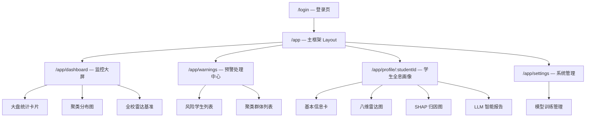
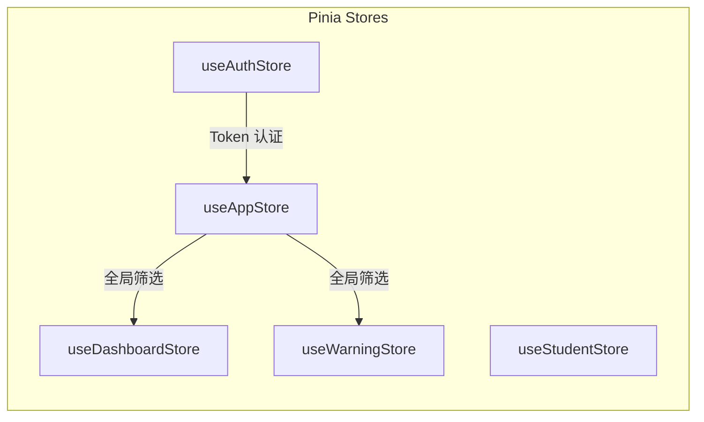
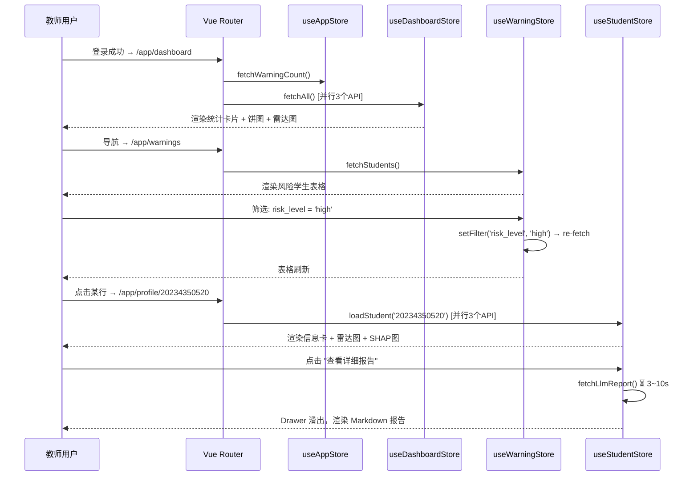

# 新前端开发蓝图与组件设计文档

> **项目名称**: 智慧教育预警系统 — 教师端  
> **技术栈**: Vue 3 (Composition API) + Vite + Pinia + Echarts 5 + Vue Router 4  
> **设计原则**: 新后端 API 为功能骨架，老前端资产为视觉血肉  
> **适用范围**: 仅教师端 / 管理员端（摒弃所有学生自助端页面）  
> **版本**: v1.0 · **日期**: 2026-03-08

---

## 1. 教师端核心页面拓扑与路由 (Teacher Routing)

### 1.1 路由树总览



### 1.2 路由配置表

| 路径 | 页面名称 | 组件文件 | 权限 | 说明 |
|------|----------|----------|:----:|------|
| `/login` | 登录页 | `LoginView.vue` | 公开 | 仅教师/管理员角色登录 |
| `/app` | 主框架 | `AppLayout.vue` | 🔒 | 侧边栏 + 顶栏 + `<router-view>` |
| `/app/dashboard` | 监控大屏 | `DashboardView.vue` | 🔒 | 登录后默认跳转页 |
| `/app/warnings` | 预警处理中心 | `WarningsView.vue` | 🔒 | 风险学生筛选列表 |
| `/app/profile/:studentId` | 学生全息画像 | `StudentProfileView.vue` | 🔒 | 动态路由，从列表点击进入 |
| `/app/settings` | 系统管理 | `SettingsView.vue` | 🔒 管理员 | 模型训练、系统配置 |

### 1.3 路由守卫策略

```
全局前置守卫 (router.beforeEach):
  ├─ 未登录 → 重定向 /login
  ├─ 已登录访问 /login → 重定向 /app/dashboard
  └─ 管理员页面 → 校验 role === 'admin'
```

> [!NOTE]
> 与老项目的 `sessionStorage` 方案不同，新系统推荐使用 **Pinia + localStorage** 持久化 Token，配合 Axios 拦截器自动附带 Authorization Header。

### 1.4 布局架构

```
┌──────────────────────────────────────────────┐
│  TopBar: 系统名称 │ 全局时间筛选器 │ 预警铃铛 │ 用户头像  │
├────────┬─────────────────────────────────────┤
│        │                                     │
│  Side  │         <router-view />             │
│  Nav   │         (页面内容区)                  │
│        │                                     │
│  ├ 📊  │                                     │
│  ├ ⚠️  │                                     │
│  ├ 👤  │                                     │
│  └ ⚙️  │                                     │
│        │                                     │
└────────┴─────────────────────────────────────┘
```

**侧边导航项**:
- 📊 监控大屏 (`/app/dashboard`)
- ⚠️ 预警中心 (`/app/warnings`)  — 含红点提示
- 👤 学生画像 — 通过预警中心列表跳转，非直接导航
- ⚙️ 系统管理 (`/app/settings`) — 仅管理员可见

---

## 2. 核心业务组件与可视化映射 (UI & API Mapping)

### 2.1 完整组件映射表

#### 📊 Page 1: 监控大屏 (DashboardView)

| 组件名称 | 承载的业务 | 推荐 Echarts 类型 / 交互形式 | 对接的新后端 API |
|----------|-----------|------|----------|
| `StatCardGroup.vue` | 风险总览统计（总人数、高/中/低风险数、风险率、AUC） | **4 张数字统计卡片** + 数字跳动动画，卡片底色按风险等级着色 | `GET /analytics/overview` |
| `ClusterPieChart.vue` | 四类行为模式聚类分布 | **环形饼图** (`pie`, `radius: ['35%','60%']`)，复用老项目 `ConsumptionType.vue` 的环形饼图方案（渐变色 + 深色描边），点击扇区跳转至聚类学生列表 | `GET /analytics/clusters` |
| `FeatureRadarChart.vue` | 八维特征全校均值基准 | **雷达图** (`radar`)，8 个维度 indicator，半透明填充区域，作为全校"平均学生"基准线展示 | `GET /analytics/feature-averages` |
| `RiskGaugeChart.vue` | 全校风险率仪表盘 | **仪表盘** (`gauge`)，指针指示风险率（0.25），区间着色（绿→黄→红） | `GET /analytics/overview` 中 `risk_rate` |

#### ⚠️ Page 2: 预警处理中心 (WarningsView)

| 组件名称 | 承载的业务 | 推荐 Echarts 类型 / 交互形式 | 对接的新后端 API |
|----------|-----------|------|----------|
| `RiskFilterBar.vue` | 风险等级筛选 + 学院筛选 + 聚类标签筛选 | **筛选器工具栏**：`<select>` 下拉 + Tag 标签式快捷筛选 | 驱动 `/warnings/students` 的 Query 参数 |
| `RiskStudentTable.vue` | 风险学生分页列表 | **数据表格** + 分页器，行内显示风险等级色标（🔴🟡🟢）、聚类标签 Badge、GPA、挂科数，行点击跳转至 `/app/profile/:studentId` | `GET /warnings/students` |
| `ClusterBarChart.vue` | 聚类群体人数对比 | **水平柱状图** (`bar`)，复用老项目 `consumptionf.vue` 的可点击水平柱图方案，y轴为 4 类聚类名称，点击跳转至该群体学生列表 | `GET /analytics/clusters` |
| `ClusterStudentDrawer.vue` | 某聚类群体下的学生列表 | **侧边抽屉 (Drawer)**，点击柱图后从右侧滑出，内含分页列表 | `GET /clusters/{label}/students` |

#### 👤 Page 3: 学生全息画像 (StudentProfileView)

| 组件名称 | 承载的业务 | 推荐 Echarts 类型 / 交互形式 | 对接的新后端 API |
|----------|-----------|------|----------|
| `StudentInfoCard.vue` | 学生基本信息 | **信息卡片**：头像占位 + 学号/性别/民族/政治面貌/籍贯/学院/专业，卡片右上角显示聚类标签 Badge + 风险等级色标 | `GET /students/{student_id}` |
| `StudentRadarChart.vue` | 个人八维雷达图 vs 全校均值 | **双层雷达图** (`radar`)，`series[0]`= 个人得分（实心半透明），`series[1]`= 全校均值（虚线轮廓），hover 显示具体分值差异 | `GET /students/{id}/features` + `GET /analytics/feature-averages` |
| `RawFeatureTable.vue` | 19 项原始指标明细 | **明细数据表**，按 8 大维度分组折叠展示，异常值高亮（如 GPA < 2.0 标红） | `GET /students/{id}/features` → `raw_features` |
| `ShapBarChart.vue` | SHAP Top 3 归因因子 | **水平条形图** (`bar`)，复用老项目 `consumptionf.vue` 的水平柱图布局，正向因子（推高风险）用红色，负向因子（降低风险）用绿色 | `GET /report/student/{id}/shap` |
| `LlmReportPanel.vue` | LLM 个性化评价报告 | **侧边滑出 Drawer** 或 **全宽展开卡片**，详见 §2.3 | `GET /report/student/{id}` |

#### ⚙️ Page 4: 系统管理 (SettingsView)

| 组件名称 | 承载的业务 | 推荐 Echarts 类型 / 交互形式 | 对接的新后端 API |
|----------|-----------|------|----------|
| `ModelTrainPanel.vue` | 一键训练模型 | **操作面板**：训练按钮 + 训练结果摘要卡片（聚类分布、AUC、样本数），训练中显示进度动画 | `POST /model/train` |

---

### 2.2 老项目图表平移方案：4 类行为模式的最佳展现

> [!IMPORTANT]
> 以下分析了老项目中哪些图表形式可以**直接平移**来展示新后端的"4 类行为模式"（奋斗学霸型、普通平庸型、游戏沉迷型、社交活跃型）。

| 老项目组件 | 老项目用途 | → 新系统平移用途 | 平移可行性 |
|-----------|-----------|-----------------|:---------:|
| `ConsumptionType.vue` — 环形饼图 | 展示消费类型占比 | → **`ClusterPieChart.vue`** 展示 4 类聚类人数占比 | ✅ 直接平移 |
| `consumptionf.vue` — 可点击水平柱图 | 展示消费水平分类（低/中/偏上/高）| → **`ClusterBarChart.vue`** 展示 4 类聚类人数柱状对比，点击跳转学生列表 | ✅ 直接平移 |
| `ConsumptionWeek.vue` — 时间轴折线图 | 展示每周消费变化 | → 暂无直接对应场景，可预留给未来"学生行为趋势追踪" | 🔜 预留 |
| `Map.vue` — 热力涟漪图 | 校园人流热力 | → 当前 API 无地理数据，暂不平移 | ❌ 暂不需要 |
| `CanteenSum.vue` — 象形柱图 | 食堂消费总量 | → 可用于 4 类聚类的创意展示（每类用不同图标） | 🔜 可选 |
| `studentDescribe.vue` — 标签卡片集 | 六维标签画像 | → **`StudentInfoCard.vue`** 中的聚类标签 Badge + 风险等级标签 | ✅ 理念平移 |

**平移总结**：
1. **环形饼图**和**水平柱图**是最适合展示 4 类行为模式的图表形式，可从老项目直接提取配色方案和布局代码
2. 老项目的**标签卡片**展示理念可平移到新系统的学生信息卡片中
3. 时间轴折线图和热力图暂时没有对应的 API 数据源，但架构设计中应预留扩展点

---

### 2.3 LLM 归因报告专项 UI 设计方案

> [!IMPORTANT]
> 针对新后端的"基于 SHAP 和 LLM 的归因解释报告"，推荐采用 **分层渐进展示** 的 UI 策略：

#### 方案：三层渐进式展开

```
┌─────────────────────────────────────────────────────────┐
│  学生全息画像页                                           │
│                                                         │
│  ┌──────────── Layer 1: 风险摘要卡片 ────────────┐       │
│  │ 🔴 高风险 87.3%  │  🏷️ 游戏沉迷型            │       │
│  │ TOP因子: 深夜沉迷(34%) ← SHAP summary        │       │
│  │                          [查看详细报告 →]      │       │
│  └────────────────────────────────────────────────┘      │
│                                                         │
│  ┌──────────── Layer 2: SHAP 归因图表 ──────────┐       │
│  │  ▓▓▓▓▓▓▓▓▓▓▓▓▓▓▓▓ 深夜沉迷天数  34%  🔴     │       │
│  │  ▓▓▓▓▓▓▓▓▓▓▓▓▓ 逃课迟到次数     28%  🔴     │       │
│  │  ▓▓▓▓▓▓▓ 绩点(GPA)             15%  🟢     │       │
│  └────────────────────────────────────────────────┘      │
│                                                         │
│  [点击 "查看详细报告" 触发 Layer 3 ↓]                    │
│                                                         │
│  ┌──────── Layer 3: LLM 报告 Drawer (右侧滑出) ──┐     │
│  │  📋 智能评价报告                    [×]        │     │
│  │  ━━━━━━━━━━━━━━━━━━━━━━━━━━━━━━━━━           │     │
│  │  ⏳ 加载中... (Skeleton 骨架屏)                │     │
│  │  ━━━━ 加载完成后 ━━━━                          │     │
│  │  ## 学生群体画像                               │     │
│  │  该学生被归类为「游戏沉迷型」...                  │     │
│  │                                               │     │
│  │  ## 核心风险指标解读                            │     │
│  │  1. **深夜沉迷天数 (45天)**...                 │     │
│  │  2. **逃课/迟到次数 (18次)**...                 │     │
│  │                                               │     │
│  │  ## 建设性改进建议                              │     │
│  │  1. 建议辅导员安排...                           │     │
│  │  ━━━━━━━━━━━━━━━━━━━━━━━━━━━━━━━━━           │     │
│  │  [📋 复制报告] [📄 导出 PDF]                   │     │
│  └───────────────────────────────────────────────┘     │
└─────────────────────────────────────────────────────────┘
```

#### 三层展示的技术要点

| 层级 | 组件 | 触发方式 | 数据来源 | 加载策略 |
|:----:|------|---------|---------|---------|
| **L1** | `RiskSummaryCard.vue` | 画像页自动加载 | `features` API 的 `risk_probability` + `cluster_name` | 与基本信息同步加载 |
| **L2** | `ShapBarChart.vue` | 画像页自动加载 | `GET /report/{id}/shap` | 进入画像页时自动请求 |
| **L3** | `LlmReportDrawer.vue` | 用户点击"查看详细报告" | `GET /report/{id}` | **懒加载**，首次点击时请求（3~10s），Skeleton 骨架屏过渡 |

#### LLM 报告 Drawer 内部设计

```vue
<!-- LlmReportDrawer.vue 核心结构 -->
<template>
  <Drawer v-model="visible" width="600px" title="📋 智能评价报告">
    <!-- 加载态 -->
    <SkeletonScreen v-if="loading" :rows="12" />
    
    <!-- 报告内容：Markdown 渲染 -->
    <article v-else class="report-content" v-html="renderedMarkdown" />
    
    <!-- 底部操作栏 -->
    <footer class="report-actions">
      <Button @click="copyReport">📋 复制报告</Button>
      <Button @click="exportPDF">📄 导出 PDF</Button>
    </footer>
  </Drawer>
</template>
```

> [!TIP]
> Markdown 渲染推荐使用 `marked` 或 `markdown-it` 库，配合 `highlight.js` 实现代码块高亮（报告中可能包含数据引用）。

---

## 3. 状态管理 (Pinia)

### 3.1 Store 规划总览



### 3.2 各 Store 详细设计

#### 🔐 `useAuthStore` — 认证状态

| State | 类型 | 说明 |
|-------|------|------|
| `token` | `string \| null` | JWT Token |
| `user` | `{ id, name, role }` | 当前登录的教师/管理员信息 |
| `isLoggedIn` | `computed<boolean>` | 计算属性：`!!token` |
| `isAdmin` | `computed<boolean>` | 计算属性：`role === 'admin'` |

| Action | 说明 |
|--------|------|
| `login(credentials)` | 调用登录 API，持久化 Token 到 localStorage |
| `logout()` | 清除状态，跳转 /login |

> **持久化**: 使用 `pinia-plugin-persistedstate` 将 `token` 持久化到 `localStorage`，替代老项目的 `sessionStorage` 方案。

---

#### 🌐 `useAppStore` — 全局应用状态

| State | 类型 | 默认值 | 说明 |
|-------|------|--------|------|
| `globalTimeRange` | `[Date, Date]` | 当前学期 | 全局时间筛选器（顶部栏），影响所有数据查询 |
| `sidebarCollapsed` | `boolean` | `false` | 侧边栏折叠状态 |
| `warningBadgeCount` | `number` | `0` | 预警铃铛的红点未读数（= 高风险学生人数） |

| Action | 说明 |
|--------|------|
| `setTimeRange(range)` | 更新全局时间范围 |
| `fetchWarningCount()` | 从 `/analytics/overview` 获取 `high_risk.count` 并更新红点 |

> [!NOTE]
> `warningBadgeCount` 应在登录后立即获取一次，之后每 5 分钟轮询刷新，确保教师始终能感知到新增风险。

---

#### 📊 `useDashboardStore` — 大盘数据

| State | 类型 | 说明 |
|-------|------|------|
| `overview` | `OverviewData \| null` | 风险总览统计卡片数据 |
| `clusters` | `ClusterItem[]` | 4 类聚类分布数据 |
| `featureAverages` | `FeatureDimension[]` | 八维全校均值 |
| `loading` | `boolean` | 数据加载状态 |

| Action | 说明 |
|--------|------|
| `fetchOverview()` | `GET /analytics/overview` |
| `fetchClusters()` | `GET /analytics/clusters` |
| `fetchFeatureAverages()` | `GET /analytics/feature-averages` |
| `fetchAll()` | 并行请求以上三个接口 |

---

#### ⚠️ `useWarningStore` — 预警中心

| State | 类型 | 说明 |
|-------|------|------|
| `students` | `RiskStudent[]` | 当前页的风险学生列表 |
| `filters` | `{ risk_level, cluster_label, college, sort_by, order }` | 筛选/排序条件 |
| `pagination` | `{ page, size, total }` | 分页元信息 |
| `loading` | `boolean` | 数据加载状态 |

| Action | 说明 |
|--------|------|
| `fetchStudents()` | 根据 `filters` + `pagination` 请求 `GET /warnings/students` |
| `setFilter(key, value)` | 更新筛选条件并重新 fetch（自动 reset page=1） |
| `setPage(page)` | 翻页 |

---

#### 👤 `useStudentStore` — 当前查看的学生画像

| State | 类型 | 说明 |
|-------|------|------|
| `currentStudentId` | `string \| null` | 当前查看的学号 |
| `basicInfo` | `StudentBasicInfo \| null` | 基本信息 |
| `features` | `StudentFeatures \| null` | 八维雷达 + 原始指标 + 聚类 + 风险 |
| `shapFactors` | `ShapResult \| null` | SHAP Top 3 归因因子 |
| `llmReport` | `string \| null` | LLM 生成的 Markdown 报告 |
| `llmLoading` | `boolean` | LLM 报告加载中（3~10s） |

| Action | 说明 |
|--------|------|
| `loadStudent(studentId)` | 并行请求 basicInfo + features + shap，缓存结果 |
| `fetchLlmReport()` | 懒加载 LLM 报告（仅在用户点击"查看详细报告"时触发） |
| `clearStudent()` | 离开画像页时清空（避免残留旧数据） |

---

### 3.3 Store 交互流程



---

## 附录 A：推荐项目目录结构

```
src/
├── main.ts                           # 入口：app.use(pinia, router)
├── App.vue                           # 根组件
├── router/
│   └── index.ts                      # 路由配置 + 守卫
├── stores/
│   ├── auth.ts                       # useAuthStore
│   ├── app.ts                        # useAppStore
│   ├── dashboard.ts                  # useDashboardStore
│   ├── warning.ts                    # useWarningStore
│   └── student.ts                    # useStudentStore
├── api/
│   ├── http.ts                       # Axios 实例 + 拦截器
│   ├── analytics.ts                  # 大盘类 API 封装
│   ├── warnings.ts                   # 预警类 API 封装
│   ├── students.ts                   # 学生类 API 封装
│   └── report.ts                     # 报告类 API 封装
├── views/
│   ├── LoginView.vue
│   ├── AppLayout.vue                 # 侧边栏 + 顶栏 + router-view
│   ├── DashboardView.vue
│   ├── WarningsView.vue
│   ├── StudentProfileView.vue
│   └── SettingsView.vue
├── components/
│   ├── common/                       # 通用 UI 组件
│   │   ├── StatCard.vue              # 统计卡片
│   │   ├── RiskBadge.vue             # 风险等级色标
│   │   ├── ClusterTag.vue            # 聚类标签 Badge
│   │   └── SkeletonScreen.vue        # 骨架屏
│   ├── charts/                       # Echarts 图表组件
│   │   ├── ClusterPieChart.vue       # 聚类饼图
│   │   ├── FeatureRadarChart.vue     # 全校/个人雷达图
│   │   ├── ShapBarChart.vue          # SHAP 归因条形图
│   │   ├── ClusterBarChart.vue       # 聚类水平柱图
│   │   └── RiskGaugeChart.vue        # 风险仪表盘
│   └── business/                     # 业务组件
│       ├── RiskFilterBar.vue         # 预警筛选栏
│       ├── RiskStudentTable.vue      # 风险学生表格
│       ├── StudentInfoCard.vue       # 学生信息卡
│       ├── RawFeatureTable.vue       # 原始特征表格
│       ├── LlmReportDrawer.vue       # LLM 报告抽屉
│       └── ModelTrainPanel.vue       # 模型训练面板
├── composables/
│   ├── useEcharts.ts                 # Echarts 初始化 + resize 封装
│   └── useMarkdown.ts               # Markdown 渲染封装
├── styles/
│   ├── variables.css                 # CSS 变量 (深色主题色板)
│   └── global.css                    # 全局重置 + 基础样式
├── types/
│   └── api.d.ts                      # API 响应类型定义
└── utils/
    ├── risk.ts                       # 风险等级颜色/文本映射
    └── format.ts                     # 数据格式化工具
```


## 附录 B：Echarts 通用封装 Composable

```typescript
// composables/useEcharts.ts — 推荐封装模式
import { ref, onMounted, onUnmounted, watch } from 'vue'
import * as echarts from 'echarts/core'

export function useEcharts(domRef: Ref<HTMLElement | null>) {
  let chart: echarts.ECharts | null = null

  const setOption = (option: echarts.EChartsOption) => {
    chart?.setOption(option, true)
  }

  onMounted(() => {
    if (domRef.value) {
      chart = echarts.init(domRef.value)
      // 自动响应容器尺寸变化
      const observer = new ResizeObserver(() => chart?.resize())
      observer.observe(domRef.value)
    }
  })

  onUnmounted(() => {
    chart?.dispose()
  })

  return { setOption }
}
```

> [!NOTE]
> 相比老项目在每个组件 `mounted` 中重复 `echarts.init` + `window.addEventListener('resize')` 的模式，此 Composable 实现了：
> 1. 统一初始化与销毁逻辑
> 2. 使用 `ResizeObserver` 替代全局 `window.resize`（更精准、低开销）
> 3. 所有图表组件只需调用 `setOption` 即可
